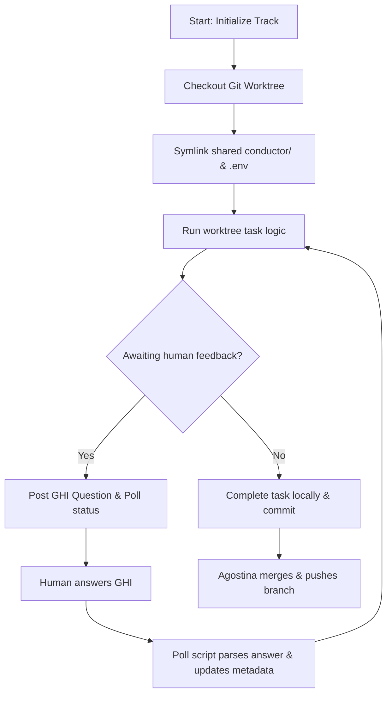

# User Manual - Conductor Worktree HITL Skill (v2.0)

This manual guides humans and agent coordinators on how to configure and execute asynchronous software development tasks using parallel Git Worktrees, Conductor++ quality gates, and GitHub Issues (GHI) for Human-in-the-Loop (HITL) communication.

---

## 🗺️ Workflow Overview

Condutree streamlines multi-agent development by partitioning tasks into isolated git worktrees. This prevents directory locking and branch conflicts, keeping task metadata and state unified in a shared central repository.



---

## 🚀 1. Setup & Installation

To run Condutree v2.0 in a repository, the following folder layout is used:
*   `conductor/` - The shared central state folder (stored in the main repository root).
*   `conductor/tracks/` - Contains subdirectories for active tracks (e.g. `issue-123`).
*   `.worktrees/` - Contains the parallel checkout directories (e.g. `.worktrees/issue-123-mario`).

### Copying Scripts
Copy the helper scripts from the skill folder to your project root `conductor/bin/` directory:
```bash
mkdir -p conductor/bin
cp scripts/* conductor/bin/
```

### Exposing `just` Target
Copy the target definition from [references/justfile](../references/justfile) into your root `justfile`:
```just
# Aggregated status check of active condutree worktrees
git-status-condutree:
    @if [ -f conductor/bin/git-status-patched.sh ]; then ./conductor/bin/git-status-patched.sh; else echo "Error: conductor/bin/git-status-patched.sh not found."; exit 1; fi
```

---

## 🌳 2. Worktree Isolation Setup

For every active track, the subagent performs the following isolation setup:

1.  **Create the Git Worktree**:
    ```bash
    git worktree add .worktrees/issue-<number>-<role> -b feature/issue-<number>
    ```
2.  **Symlink shared metadata**:
    ```bash
    ln -s ../../conductor conductor
    ```
3.  **Symlink shared environment configuration (v2.0)**:
    ```bash
    if [ -f ../../.env ]; then ln -s ../../.env .env; fi
    ```
4.  **Configure Git Hygiene**: Exclude these symlinks from being tracked by Git:
    ```bash
    echo "conductor" >> $(git rev-parse --git-dir)/info/exclude
    echo ".env" >> $(git rev-parse --git-dir)/info/exclude
    ```

---

## 🛠️ 3. Utility Scripts Reference

### 1. `git-status-patched.sh` / `git_status_patched.py` (v2.0)
The status aggregator script walks through all active worktrees inside `.worktrees/` and cross-references them against registered tracks in `conductor/tracks/`.
*   **Run**: `just git-status-condutree`
*   **Outputs**:
    *   Worktree folder and checked-out branch.
    *   Assigned agent.
    *   Git status summary (counts of added, modified, or deleted files).
    *   Current active task.
    *   Any active questions awaiting human response.

### 2. `conductor-inspector`
Inspects all tracks in the tracks registry.
*   **Run**: `conductor-inspector --all` or `conductor-inspector --open`
*   **Outputs**: Terminal status board showing status columns (`STATUS`, `PROGRESS`, `RATIO`, `GHI`, `AGENT`, `CHANGED`).

### 3. `inject-ghi`
Injects GitHub Issue subtasks directly into a track's `"tasks"` metadata.
*   **Run**: `./conductor/bin/inject-ghi --issue <issue_number>`

### 4. `poll_ghi_questions.py`
Monitors GitHub Issues for comments starting with `[ANSWER]`. When found, it parses the payload and marks the corresponding question in `metadata.json` as answered, allowing the subagent to wake up and resume.

---

## 📊 4. Schema Reference Files

For concrete JSON structures, refer to:
*   [track-initial.json](../references/track-initial.json) - Empty unassigned track template.
*   [track-assigned.json](../references/track-assigned.json) - Assigned agent & worktree metadata template.
*   [question-awaiting.json](../references/question-awaiting.json) - Structure for HITL questions posted to GitHub comments.
*   [question-answered.json](../references/question-answered.json) - Resolved question structure containing human answer & vehicle metadata.
